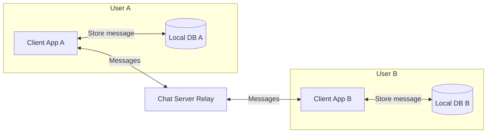
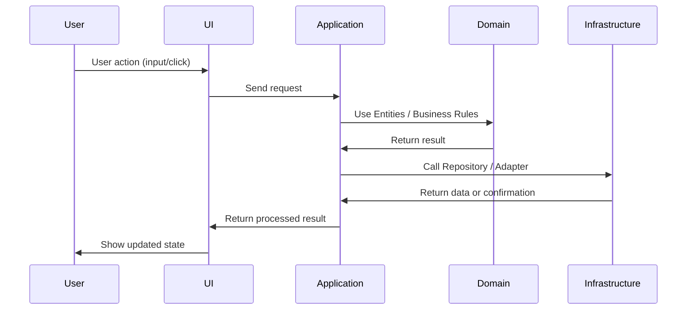
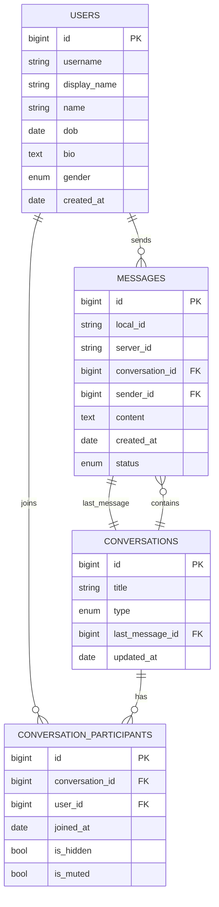
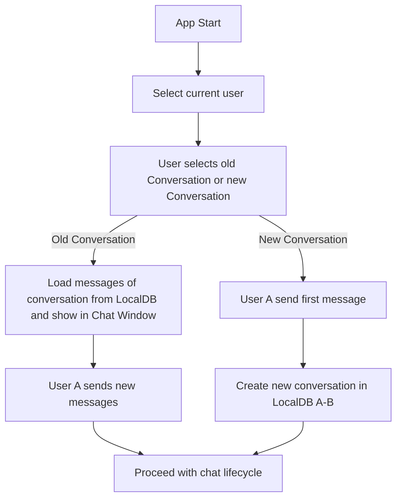
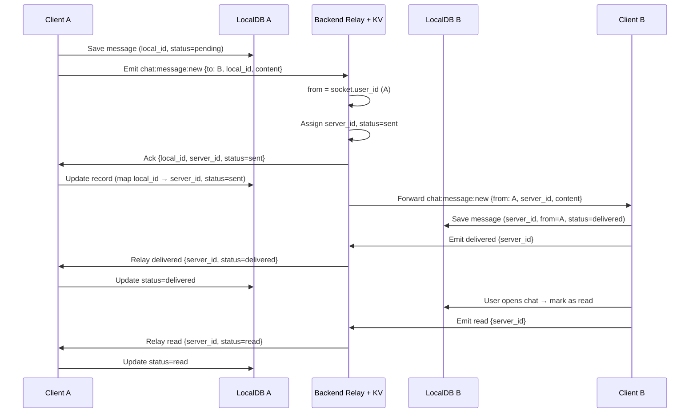

# 📄 Document – Chat App ElectronJS

## 1. Overview

- **Feature**: Peer-to-peer messaging (1:1 chat) with ElectronJS.
- **Goal**: Enable direct messaging between two registered users with **offline-first local storage**, real-time delivery
- **Stack**:
  - **Frontend**: Electron / ReactJS for cross-platform.
  - **Client DB**: IndexedDB (Web + PC).
  - **Backend**: NodeJs / ExpressJS (relay + key-value store only).
  - **Realtime**: WebSocket.
- **Out of Scope**:
  - Media.
  - Authentication (users pre-provisioned - seed data).
  - Group chat.
  - Encryption.

---

## 2. Requirements

### Functional

- Retrieve conversation list from **LocalDB**.
- Persist messages locally (IndexedDB/SQLite).
- Fetch message history with pagination (from LocalDB).
- Send message → save locally → emit via socket → update status on ack.
- Retry unsent messages automatically when reconnecting.
- Update message state (`pending`, `sent`, `delivered` ,`read`).
- Local search on message content.

### Non-functional

- Latency: <500ms for socket message delivery.
- Offline-first: app works when disconnected, retries automatically.
- Message durability: persisted in LocalDB.
- Cross-platform DB abstraction (Web vs PC).

---

## 3. System Design

### 3.1 Component Diagram



---

### 3.2 Frontend Structure

**3.2.1 Flow diagram**



**Specific Example: Sending a Message**

- **UI**: The user types "Hello" and presses Enter
- **App Service**: Receives a request to send a message with the content "Hello"
- **Use Case**: `sendMessage()` creates a new `Message` entity and checks business logic
- **Domain**: A `Message` entity is created with the necessary attributes; the Repository interface defines how it is stored
- **Infrastructure**:
  - Save the message into IndexedDB (local storage)
  - Send the message via Socket to the server (real-time communication)

**Architecture Overview**

- **Domain Layer (the inner core)**
  Contains **Entities, Events, and Repository Interfaces**.
  This is where the **business rules** live. It does not depend on anything outside.
- **Application Layer**
  Contains the **use cases** – what the application can do.
  It uses the Domain to process requests and coordinate the workflow.
- **Infrastructure Layer**
  Contains technical details like **IndexedDB and Socket**.
  These are the actual implementations of the Repository Interfaces defined in the Domain.
- **UI Layer (the outer shell)**
  Handles user interaction: shows data to the user and sends input to the Application.

```
chat-electron/FE/src/
│
├── core/                              # Business Logic Layer
│   ├── domain/                        # Domain Layer
│   │   ├── conv/                      # Conversation Aggregate
│   │   │   ├── entity.ts              # Conversation entity + factory
│   │   │   ├── events.ts              # Domain events
│   │   │   └── repo.ts                # Repository interface
│   │   │
│   │   ├── conv-participant/          # Participant Entity
│   │   │   ├── entity.ts
│   │   │   └── repo.ts
│   │   │
│   │   ├── msg/                       # Message Aggregate
│   │   │   ├── entity.ts
│   │   │   ├── events.ts
│   │   │   └── repo.ts
│   │   │
│   │   └── user/                      # User Aggregate
│   │       ├── entity.ts
│   │       └── repo.ts
│   │
│   └── app/                           # Application Layer
│       ├── app-service.ts             # Main facade
│       ├── conv.uc.ts                # Conversation operations
│       ├── msg.uc.ts                 # Message operations
│       ├── user.uc.ts                # User operations
│       ├── event-bus.ts               # Event system
│       │
│       └── handler/                   # Event Handlers
│           ├── msg-create.handler.ts
│           ├── msg-status-updated.handler.ts
│           └── msg-retry.handler.ts
│
├── infra/                             # Infrastructure Layer
│   ├── db/                            # IndexedDB implementations
│   │   ├── db.ts
│   │   ├── conv.repo.idb.ts
│   │   ├── conv-participant.repo.idb.ts
│   │   ├── msg.repo.idb.ts
│   │   └── user.repo.idb.ts
│   │
│   └── socket/                        # Socket.IO client
│       └── socket.ts
│
├── renderer/                          # React UI
│   └── src/
│       ├── App.tsx
│       ├── main.tsx
│       ├── components/
│       ├── hooks/
│       └── pages/
│
├── main/                              # Electron Main Process
│   └── index.ts
│
├── preload/                           # Electron Preload
│   ├── index.ts
│   └── index.d.ts
│
└── bootstrap.ts                       # Setup
```

---

### 3.3 Backend Structure

```
BE/src/
├── index.ts                    # HTTP server entry point
├── config/
│   └── socket.config.ts       # Socket.IO configuration
├── socket/
│   ├── index.ts               # Socket module entry point
│   ├── handlers.ts            # Event handlers logic
│   ├── state.ts               # State management (userSockets, pendingMessages)
│   └── utils.ts               # Helper functions (findSender, notifySender)
└── types/
    ├── events.ts              # ChatEvent enum
    ├── payloads.ts            # EventPayloads interface
    └── common.ts              # Message, User types
```

---

## 4. Data Model



- **USERS ||--o{ CONVERSATION_PARTICIPANTS:** A user can join many conversations, and a conversation can have many users. This is an n-n relationship, so it requires a junction table.
- **CONVERSATIONS ||--o{ CONVERSATION_PARTICIPANTS:** A conversation can have many participants.
- **CONVERSATIONS ||--o{ MESSAGES:** A conversation contains many messages.
- **USERS ||--o{ MESSAGES:** A user can send many messages.
- **MESSAGES ||--o{ CONVERSATIONS : "last_message":** A conversation can reference the last message through `last_message_id`. This is a special 1-1 relationship to make displaying the latest message more efficient.

---

## 5. App Flow

### 5.1 Chat Conversation Flow



### 5.2 Chat Message Lifecycle



---

---

## 6. Implementation Plan

### Environment

- [ ] Setup project structure (Frontend + Backend).
- [ ] Configure build tools (Electron, React, Node/Express).

### Frontend

- [ ] Setup LocalDB (IndexedDB).
- [ ] Implement service
- [ ] Build UI components

### Backend

- [ ] Setup WebSocket relay (forward + ack).
- [ ] KV store (in-memory).

---

## 7. Testing Strategy

| Module             | Function                 | Test Case                | Expected Result                  |
| ------------------ | ------------------------ | ------------------------ | -------------------------------- |
| **LocalDB**        | `saveMessage`            | Save + load message      | Persisted correctly              |
| **MessageService** | `sendMessage`            | Valid input              | Status changes: `pending → sent` |
| **SyncService**    | `retryPending`           | Offline → online         | Pending messages resent          |
| **SocketHandler**  | `on("chat:message:new")` | Incoming payload handled | Inserted into LocalDB            |

---

## 8. Risks & Future Work

- **In-memory KV Store**: Current server design keeps message status and sessions in memory only. A server restart will lose this state.
- **Scaling**: large volume of messages
- **Future**: search.
