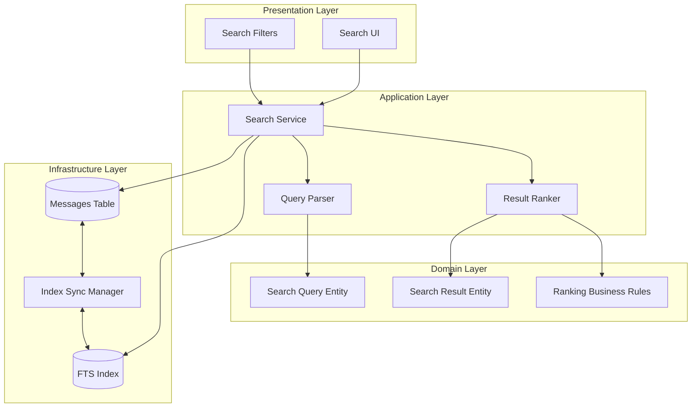
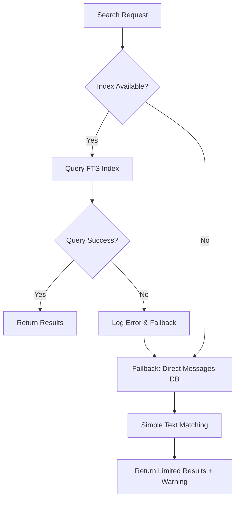
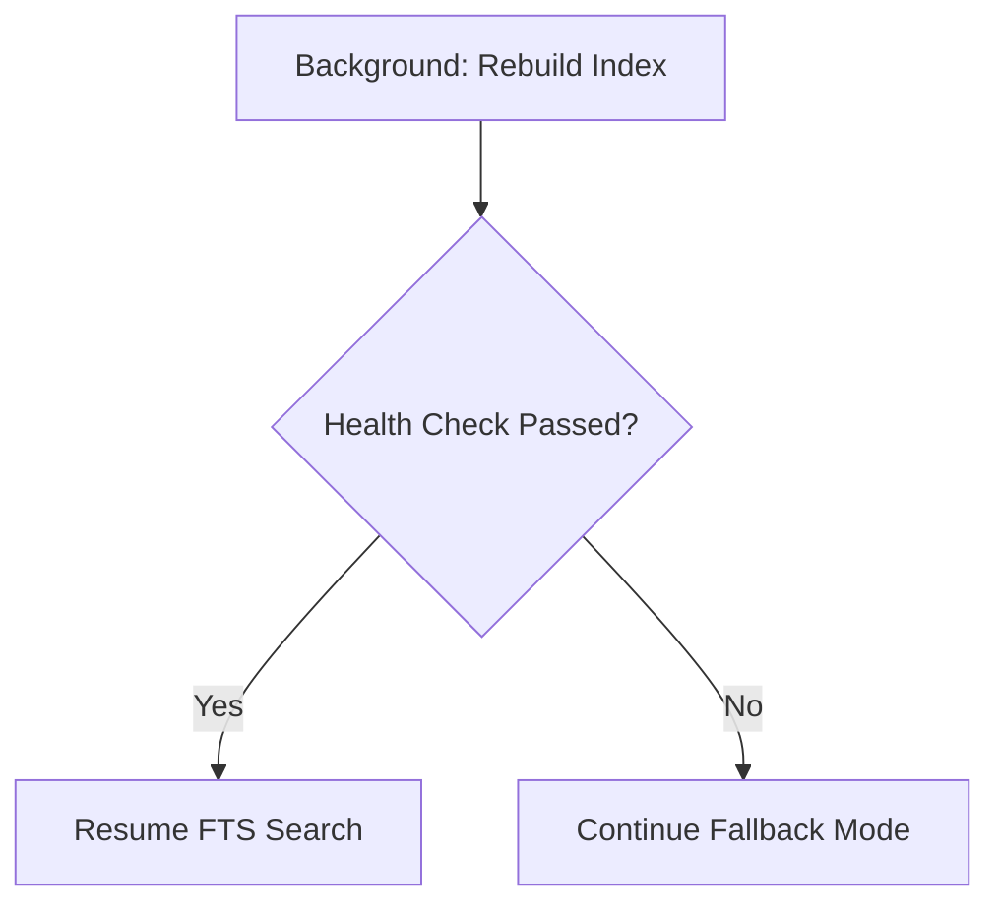
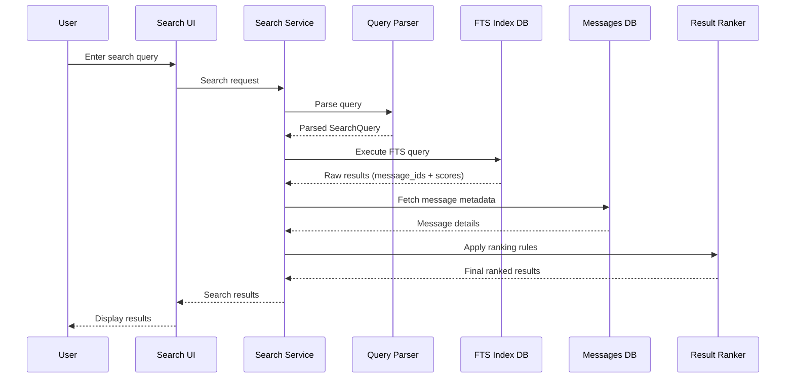
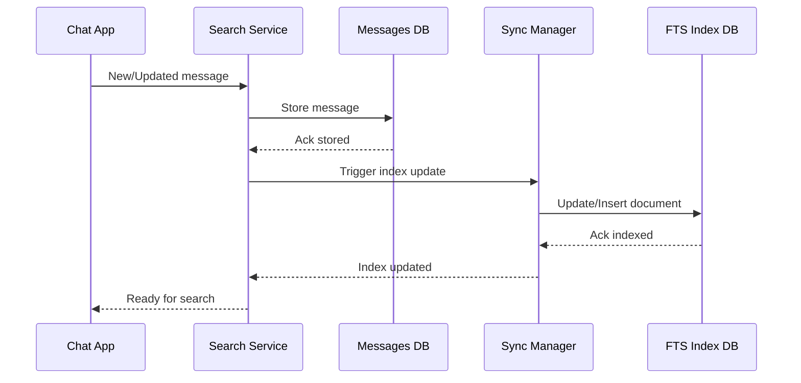
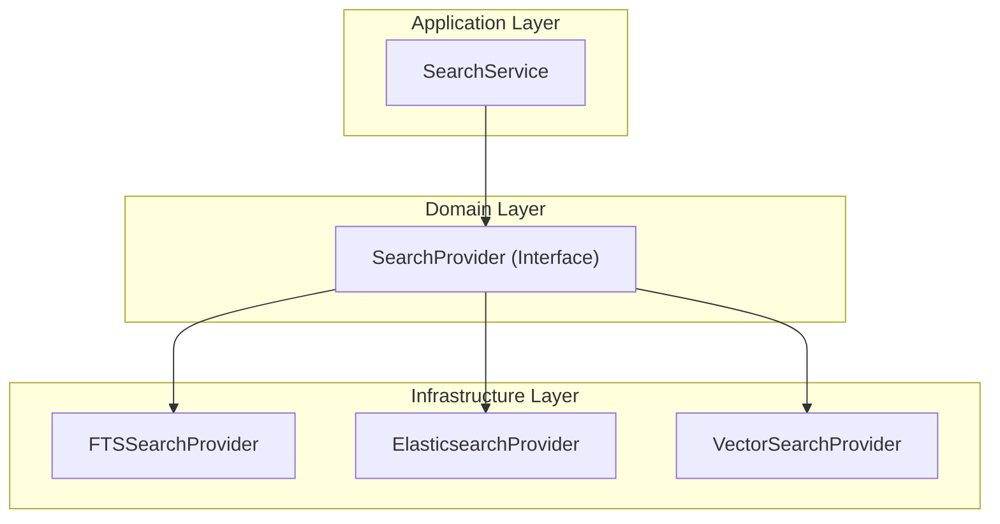
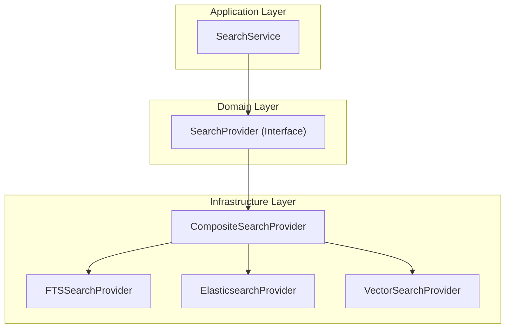

# Search System Design Document

## 1. Executive Summary

### 1.1 Overview

Design of a message search system for chat applications with local-first architecture, optimized for speed, accuracy, and future scalability.

### 1.2 Key Design Decisions

- **Technology**: Full-Text Search (FTS)
- **Architecture**: Layered design with clear separation of concerns
- **Performance Target**: Under 200ms per query on 100K+ messages dataset
- **Scalability**: Easy to extend and adapt for other search features later (Elasticsearch, Vector Search)

---

## 2. System Requirements

### 2.1 Functional Requirements

**Core Search Features**

- **Exact Match**: Search for precise keywords by character string
- **Instant Search**: Support prefix search result display
- **Full-Text Search**: Rank results by relevance using BM25/TF-IDF algorithms
- **Advanced Filtering**: Filter results by sender, conversation, time range

**Data Management**

- Ensure data consistency between Chat DB and Search Index DB

### 2.2 Non-Functional Requirements

**Performance Requirements**

- **Latency**: Each search query must complete within < 200ms to ensure smooth user experience
- **Dataset Size**: Support search up to 100,000 messages, suitable for personal chat app scale

**Reliability Requirements**

- **Offline Support**: Operate completely offline, no dependency on network connection
- **Data Consistency**: Synchronize data between message store and search index
- **Extensibility**: Modular design allowing future search technology replacement

### 2.3 Out of Scope

- Media search (search within images, videos, file attachments)
- Group chat search

---

## 3. Technology Research & Selection

### 3.1 Technology Comparison Analysis

**String Matching Algorithms (Naïve, KMP, Rabin-Karp)**

- **Pros**: Simple implementation, no complex infrastructure needed
- **Cons**: O(n·m) complexity unsuitable for large datasets, no ranking support
- **Suitable for**: Small datasets only for speed guarantee

**Binary/Prefix Tree Index**

- **Pros**: Fast O(n+m) query speed for exact match and prefix search
- **Cons**: Additional memory usage, no full-text search support, lacks relevance ranking capability
- **Suitable for**: Autocomplete, dictionary lookup

**Inverted Index (Full-Text Search)**

- **Pros**: Optimized for text search with O(n) speed, easy to extend Boolean queries, BM25/TF-IDF
- **Cons**: Additional memory usage for index
- **Suitable for**: Text search on large datasets

**External Search Engines (Elasticsearch, Solr)**

- **Pros**: Technology based on FTS, good scalability, many built-in analyzer features, clustering support
- **Cons**: Requires separate server, complex operations, unsuitable for local-first
- **Suitable for**: Server search, high operational costs

**Vector Search (Semantic Search)**

- **Pros**: Semantic search, AI-powered search support
- **Cons**: Requires compute power for embedding, unsuitable for offline
- **Suitable for**: AI chatbot, semantic search with server backend

### 3.2 Selected Solution: Inverted Index (FTS)

**Reasons for choosing FTS:**

Inverted Index is the optimal choice as it fully meets system requirements:

- High performance for text search on large message datasets
- Supports all required search modes and ranking algorithms (exact, prefix, full-text, filtering, BM25, TF-IDF)
- Supports local search

**Trade-offs:**

- Increased memory usage for index
- More complex than simple string matching
- Requires data synchronization maintenance

---

## 4. System Architecture

### 4.1 High-Level Architecture



### 4.2 High-Level Component Responsibilities

**Presentation Layer**

- **Search UI**: Receive user input, display search results with highlighting and pagination
- **Search Filters**: Provide interface for advanced search (filter by user, conversation, date range)

**Application Layer**

- **Search Service**: Orchestrate entire search flow, handle business logic, combine results from multiple sources
- **Query Parser**: Parse and validate search queries, handle special syntax (quotes, operators)
- **Result Ranker**: Apply ranking algorithms, combine multiple scoring factors

**Domain Layer**

- **Search Entities**: Define domain models (SearchQuery, SearchResult) and validation rules
- **Ranking Rules**: Contain business logic for result scoring (recency, relevance, user preferences)

**Infrastructure Layer**

- **FTS Index DB**: Store inverted index, perform full-text search operations
- **Messages DB**: Store original messages, provide metadata for search results
- **Sync Manager**: Ensure consistency between Messages DB and FTS Index

### 4.3 Error Handling Components

**FTS Index DB error cases that need handling:**

1. **Index Corruption**
   - FTS index corrupted due to crash, disk error, or write failure
   - Detected through integrity check failures
   - Requires complete index rebuild from Messages table
2. **Index-Message Inconsistency**
   - Messages DB has new data but FTS index not yet synced
   - FTS index has old data that Messages DB has deleted
   - Detected through checksum or row count mismatch
3. **Index Performance Degradation**
   - Index too fragmented, queries slower than 200ms threshold
   - Memory usage exceeds limits
   - Requires optimization or rebuild

### 4.4 Error Handling Detail

**1. Health Check Mechanism**

- **Health Monitor**: Periodically check index integrity and performance
- **Fallback Search Engine**: Simple string matching when FTS index unavailable
- **Index Rebuilder**: Automatically rebuild index from Messages table when corruption detected
- **Circuit Breaker**: Temporarily halt FTS queries when failure rate high, switch to fallback



**2. Health Check Query**

```sql
-- Run periodically every 30 minutes
INSERT INTO fts_index_global(fts_index_global) VALUES('integrity-check');

-- Compare row counts
SELECT
    (SELECT COUNT(*) FROM messages) as messages_count,
    (SELECT COUNT(*) FROM fts_index_global) as index_count;

```

**3. Fallback Search Logic**

```sql
-- When FTS index fails, fallback to LIKE search in raw data
SELECT message_id, content, created_at
FROM messages
WHERE content LIKE '%search_term%' AND conversation_id = ?
ORDER BY created_at DESC
LIMIT 20;

```

**4. Auto-Recovery Process**



- Detect failure → Log error → Switch to fallback mode
- Background rebuild index from Messages table
- Health check passed → Resume FTS search
- Notify user about degraded performance during rebuild

---

## 5. Data Flow Design

### 5.1 Search Query Flow

When user performs a search:

1. **User Input**: User enters query into Search UI
2. **Query Processing**: Search Service receives request and sends to Query Parser
3. **Query Parsing**: Parser analyzes query, determines search mode (exact/fuzzy/boolean)
4. **Index Search**: Execute FTS query on Inverted Index, return list of message_id and raw scores
5. **Metadata Enrichment**: Search Service fetches additional information from Messages DB (sender, conversation, timestamp)
6. **Result Ranking**: Result Ranker applies business rules to calculate final score
7. **Response**: Return ranked results to UI for display



### 5.2 Index Update Flow

When new messages are created or updated:

1. **Message Creation/Update**: Chat app creates or updates message
2. **Database Update**: Search Service saves message to Messages DB
3. **Index Synchronization**: Sync Manager triggered to update FTS Index
4. **Index Update**: FTS Index DB updated with new content
5. **Completion**: Message ready for search



---

## 6. Detailed Technical Design

### 6.1 DB Search Design Solutions

| Approach                                                            | Description                                                          | Pros                                            | Cons |
| ------------------------------------------------------------------- | -------------------------------------------------------------------- | ----------------------------------------------- | ---- |
| **1. Global Index + Metadata Conversation**                         | Single FTS table + metadata table managing conversations             | • Simple cross-conversation queries             |
| • Good count & analytics support                                    | • Main index table can grow large with lots of data                  |
| • Conversation deletion not immediate (mark deleted, batch cleanup) |
| **2. Per-Conversation Index**                                       | Each conversation has separate FTS table                             | • Fast search within conversation (small index) |
| • Very clean conversation deletion (`DROP TABLE`)                   | • Complex cross-conversation search (query multiple indexes + merge) |

• Management overhead with many tables as conversations grow
• Fragmented count & analytics |
| **3. Hybrid Indexing (Global + Per-Conversation)** | Both global index and per-conversation indexes | • Fast cross-conversation search
• Fast search within conversation
• Conversation deletion both drops per-conv and batch cleanup global | • Data duplication, storage waste
• More complex sync logic |

### 6.2 Trade-off Selection

**System Context:**

- **Local-first** chat app, many users but each user has separate DB
- Average dataset 100k messages per user
- Users frequently need **global search (cross-conversation)**
- Immediate deletion requirement **less important than** consistent search & easy maintenance

**Choice: Global Index + Metadata**

- Simplest to implement and maintain
- Best fit for performance and storage of use case
- Main drawbacks (main index growth, cleanup) can be handled by:
  - Batch delete instead of individual message deletion
  - Periodic VACUUM / REBUILD index

### 6.3 Database Schema Design

**Global FTS Index Table**

```sql
CREATE VIRTUAL TABLE fts_index_global USING fts5(
    message_id UNINDEXED,
    conversation_id UNINDEXED,
    content,
    created_at UNINDEXED,
);
```

- `message_id`: unique key mapping to main DB
- `conversation_id`: filter by conversation
- `content`: content for search
- `created_at`: support filtering or ranking by time

**Conversation Metadata Table**

```sql
CREATE TABLE conversation_meta (
    conversation_id INTEGER PRIMARY KEY,
    is_deleted INTEGER NOT NULL DEFAULT 0,
    last_message_at INTEGER,
);

CREATE INDEX idx_conversation_meta_deleted_time
ON conversation_meta(is_deleted, last_message_at DESC);
```

- `is_deleted`: mark deleted conversations, helps with fast filtering
- `last_message_at`: support conversation sorting/filtering
- `idx_conversation_meta_deleted_time` : list of not deleted conversations, recently operated.

### 6.4 Search Modes Implementation

**Exact Match Search**

- **Meaning**: Find exact phrase match
- **Implementation**: Use phrase query with `" "` quotes

```sql
SELECT *
FROM fts_index_global
WHERE fts_index_global MATCH '"exact phrase"';
```

**Instant/Prefix Search**

- **Meaning**: Suggestions when user types partial keywords
- **Implementation**: Use wildcard

```sql
SELECT *
FROM fts_index_global
WHERE fts_index_global MATCH 'prefix*';
```

**Full-Text Search with BM25 Ranking**

- **Meaning**: Sort results by relevance (BM25)
- **Implementation**: Apply `bm25()` with tuning parameters

```sql
SELECT *
FROM fts_index_global
WHERE fts_index_global MATCH 'search terms'
ORDER BY bm25(fts_index_global) DESC;
```

### 6.5 Ranking Algorithm

Final score calculated using formula, that build in Application Layer

```
Final Score = (w1 × Recency Boost) + (w2 × Conversation Activity Score)
```

**Component explanations:**

- **Recency Boost**: Recent messages prioritized, decreasing over time (max 5 points)
- **Conversation Activity Boost**: Recently active conversations boosted (max 3 points)

---

## 7. Performance Optimization

### 7.1 Query Optimization Techniques

**Index Partitioning Strategy for Active Conversations within 30 days**

- Common queries will only scan subset of messages → faster
- For rare queries needing old data, system falls back to global index (slower)

```sql
CREATE INDEX idx_fts_active_conversations
ON fts_index_global(conversation_id)
WHERE conversation_id IN (
    SELECT conversation_id FROM conversation_meta
    WHERE is_deleted = 0 AND last_message_at > unixepoch('now') - 2592000
);
```

**Result Caching**

Cache results of recent queries in memory:

- TTL: 5 minutes for search results
- Invalidate cache when new messages arrive

### 7.2 Memory Management

**Data Compression**

Data will be compressed to reduce DB size:

```sql
CREATE VIRTUAL TABLE fts_index_global USING fts5(
    message_id UNINDEXED,
    conversation_id UNINDEXED,
    content,
    created_at UNINDEXED,
    compress='zlib',
    uncompress='zlib'
);
```

**Periodic Cleanup**

Run periodic cleanup to compact segments and garbage collect data:

```sql
INSERT INTO fts_index_global(fts_index_global) VALUES('optimize');
```

**Progressive Loading**

Limit result count to avoid memory spikes and reduce latency with large datasets:

```sql
SELECT message_id, final_score
FROM search_results_view
WHERE final_score >= ?
ORDER BY final_score DESC
LIMIT 20
OFFSET ?;
```

---

## 8. Plugin Architecture

The system is designed as a model that easily adapts to support both expansion directions: changing search engines and combining multiple search engines to produce unified results.

### 8.1 Switching Search Provider



### 8.2 Composite/Hybrid Search Provider



---

## 9. Implementation Roadmap

### Phase 1: Basic FTS Setup

- Implement Messages table and FTS index schema
- Basic exact match search functionality
- Simple UI for search input and results display

### Phase 2: Advanced Search Features

- Instant search with prefix matching
- Filtering by user, conversation, date range
- Result highlighting and snippets

### Phase 3: Ranking and Optimization

- Implement BM25 ranking algorithm
- Add recency and conversation activity boosts
- Performance tuning and memory optimization

### Phase 4: Reliability & Recovery

- Implement periodic **Health Check** for FTS index (integrity check, row count check)
- Build **Fallback Search** (LIKE search, limited scope to avoid slowness)
- **Auto-Rebuild Index** mechanism when index errors or inconsistency occurs
- Logging & monitoring: record search errors, alert if query >200ms
- Test recovery flow with simulated scenarios (corruption, missing data)
